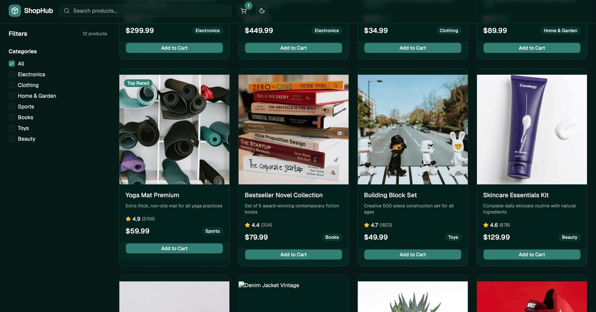

# ShopHub - Product Catalog

A modern, responsive product catalog built with React 19, TypeScript, Vite, and Tailwind CSS v4.



**Live Demo**: https://grikomsn.github.io/product-catalog-vite/

## Features

- **🛍️ Product Catalog**: Browse 12 premium products across 7 categories
- **🔍 Search & Filter**: Real-time search with URL-persisted filters
- **📱 Responsive Design**: Optimized for desktop, tablet, and mobile
- **🛒 Shopping Cart**: Add items with quantity controls, persists via localStorage
- **📄 Product Pages**: Individual product detail pages with reviews
- **🌓 Dark Mode**: Automatic/system theme switching
- **🔒 SEO Optimized**: Complete meta tags, Open Graph, JSON-LD structured data
- **♿ Accessible**: Built with shadcn/ui accessible components

## Tech Stack

- **React 19** - Latest React with concurrent features
- **TypeScript** - Type-safe development
- **Vite** - Fast build tool and dev server
- **Tailwind CSS v4** - Utility-first CSS
- **shadcn/ui** - Accessible component primitives
- **React Router v7** - Client-side routing with slug-based URLs
- **Zustand** - State management with persistence
- **Bun** - Package manager and runtime

## Quick Start

```bash
# Install dependencies
bun install

# Start dev server
bun run dev

# Build for production
bun run build

# Preview production build
bun run preview
```

## Deployment

This project auto-deploys to GitHub Pages on every push to `main`. The workflow is defined in `.github/workflows/deploy.yml`.

**Live site**: https://grikomsn.github.io/product-catalog-vite/

## Project Structure

```
src/
  components/
    cart/           # Cart drawer component
    filter/         # Category filter components
    layout/         # Navbar and layout components
    product/        # Product card and grid components
    seo/            # SEO component
    ui/             # shadcn/ui components
  data/
    products.ts     # Product data and types
  lib/
    slug.ts         # URL slug utilities
    utils.ts        # Helper functions
  pages/
    HomePage.tsx           # Product listing with filters
    ProductDetailPage.tsx  # Individual product view
  stores/
    cartStore.ts    # Zustand cart state with persistence
  App.tsx           # Router configuration
  main.tsx          # App entry point
  index.css         # Tailwind styles
public/
  opengraph.jpg     # Social sharing image (1200x630)
  favicon.svg       # Site favicon
```

## Features in Detail

### Search & Filters
- Real-time product search
- Category filtering with multi-select
- URL-based filter persistence (shareable links)
- Browser history integration (back/forward support)

### Shopping Cart
- Add/remove items with quantity controls
- Cart drawer with item management
- localStorage persistence across sessions
- Total price calculation

### SEO
- Dynamic meta titles and descriptions
- Open Graph tags with custom image
- Twitter Card support
- JSON-LD structured data:
  - Organization
  - WebSite with search action
  - Store
  - Product (on detail pages)
  - BreadcrumbList

## Available Scripts

| Command | Description |
|---------|-------------|
| `bun run dev` | Start dev server with HMR |
| `bun run build` | Type check and production build |
| `bun run lint` | Run ESLint |
| `bun run preview` | Preview production build locally |

## Customization

### Products
Products are defined in `src/data/products.ts`. Each product includes:
- `id`: Unique identifier
- `name`: Product name (used for URL slug)
- `description`: Product description
- `price`: Price in USD
- `category`: Category name
- `rating`: Average rating (1-5)
- `reviews`: Number of reviews
- `image`: Image URL (supports external Unsplash images)
- `badge`: Optional badge ("Best Seller", "Top Rated")

### SEO Configuration
Update the base URL in `src/components/seo/SEO.tsx`:
```typescript
const BASE_URL = "https://yourusername.github.io/your-repo";
```

Replace `public/opengraph.jpg` with your own 1200x630px social sharing image.

## License

MIT
